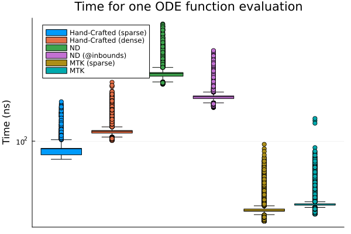

# Defining dynamical systems on networks in Julia

This repo showcases various ways of defining dynamical systems in Julia, and compares their performances. See `network-dynamics.ipynb` and `benchmarks.jl` for that.

See [here](https://irregular-rhomboid.github.io/2023/05/27/julia-modelling-network-systems.html) for a blog post based on this repo.

## Benchmark results

Performance of the ODE functions generated by the various methods on a network with 5 nodes:

Median run time of the various ODE functions as a function of the number of nodes.

